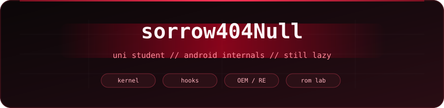
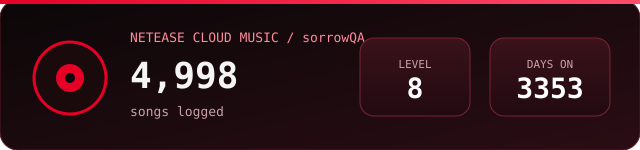

 

  

---

###  whoami

university student.  
day job I gave myself: **kernels · hooks · OEM guts**.  
ships when motivated. sleeps when not.

---

###  stack

  

 

  
  
  
  
  
  
  
  

---

###  desk

|  phones |  laptop |  tablet |
| :---: | :---: | :---: |
| **Realme GT8 Pro** | **Mechrevo Jiaolong 16 Pro** | **iPad 2021 · M1** |
| Xiaomi 15 · Redmi K70 | RTX **5070Ti** | always in the bag |

  
  
  
  
  

---

###  on netease

  

---

###  pulse

  
  

 

  

---

  

